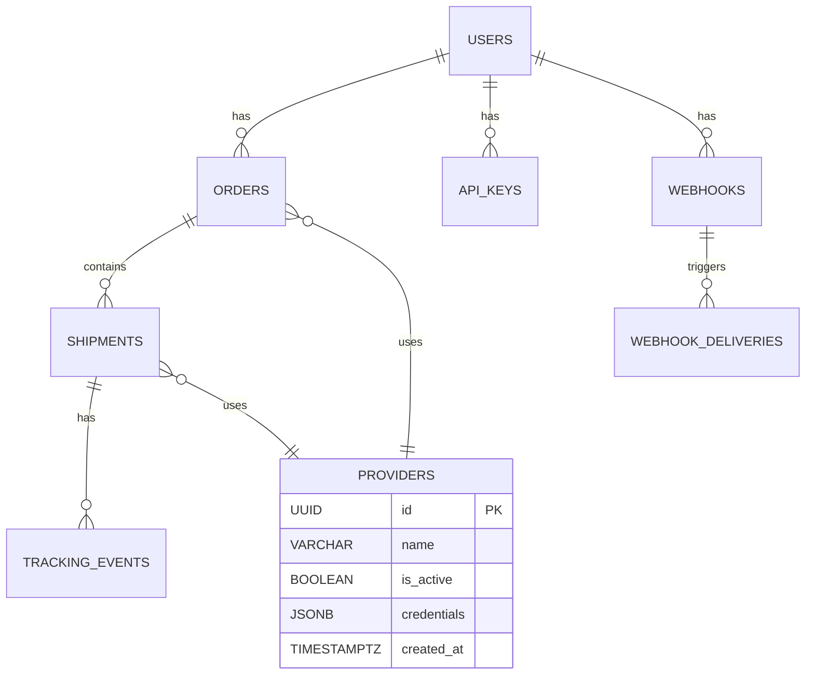

# Database Schema Documentation

This document describes the Multiship database schema, including tables, relationships, and data types.

## 📊 Core Tables

### Users
User accounts and authentication information.

```sql
CREATE TABLE users (
  id UUID PRIMARY KEY DEFAULT gen_random_uuid(),
  email VARCHAR(255) UNIQUE NOT NULL,
  password_hash VARCHAR(255) NOT NULL,
  first_name VARCHAR(100),
  last_name VARCHAR(100),
  role VARCHAR(50) NOT NULL DEFAULT 'user',
  is_active BOOLEAN NOT NULL DEFAULT true,
  email_verified BOOLEAN NOT NULL DEFAULT false,
  last_login_at TIMESTAMPTZ,
  created_at TIMESTAMPTZ NOT NULL DEFAULT NOW(),
  updated_at TIMESTAMPTZ NOT NULL DEFAULT NOW(),
  deleted_at TIMESTAMPTZ
);

-- Indexes
CREATE INDEX idx_users_email ON users(email);
CREATE INDEX idx_users_role ON users(role);
CREATE INDEX idx_users_active ON users(is_active) WHERE deleted_at IS NULL;
```

### Orders
Customer shipping orders and associated metadata.

```sql
CREATE TABLE orders (
  id UUID PRIMARY KEY DEFAULT gen_random_uuid(),
  order_number VARCHAR(100) UNIQUE NOT NULL,
  user_id UUID NOT NULL REFERENCES users(id),
  status VARCHAR(50) NOT NULL DEFAULT 'pending',
  provider VARCHAR(50), -- easypost, shippo, veeqo
  provider_order_id VARCHAR(255), -- ID from provider system

  -- Customer information
  customer_name VARCHAR(255) NOT NULL,
  customer_email VARCHAR(255) NOT NULL,
  customer_phone VARCHAR(50),

  -- Shipping addresses (JSONB for flexibility)
  shipping_address JSONB NOT NULL,
  billing_address JSONB,

  -- Order items
  items JSONB NOT NULL DEFAULT '[]',

  -- Shipping details
  service_level VARCHAR(50), -- standard, express, overnight
  total_weight DECIMAL(10,3),
  total_value DECIMAL(10,2),

  -- Costs and tracking
  shipping_cost DECIMAL(8,2),
  insurance_cost DECIMAL(8,2),
  total_cost DECIMAL(8,2),
  tracking_number VARCHAR(255),
  tracking_url TEXT,
  estimated_delivery DATE,
  actual_delivery TIMESTAMPTZ,

  -- Metadata
  metadata JSONB DEFAULT '{}',
  tags TEXT[] DEFAULT '{}',

  -- Timestamps
  shipped_at TIMESTAMPTZ,
  delivered_at TIMESTAMPTZ,
  cancelled_at TIMESTAMPTZ,
  created_at TIMESTAMPTZ NOT NULL DEFAULT NOW(),
  updated_at TIMESTAMPTZ NOT NULL DEFAULT NOW(),

  -- Soft delete
  deleted_at TIMESTAMPTZ
);

-- Indexes
CREATE INDEX idx_orders_user_id ON orders(user_id);
CREATE INDEX idx_orders_status ON orders(status);
CREATE INDEX idx_orders_provider ON orders(provider);
CREATE INDEX idx_orders_tracking ON orders(tracking_number);
CREATE INDEX idx_orders_created_at ON orders(created_at);
CREATE INDEX idx_orders_active ON orders(deleted_at) WHERE deleted_at IS NULL;
```

### Shipments
Individual shipment records created from orders.

```sql
CREATE TABLE shipments (
  id UUID PRIMARY KEY DEFAULT gen_random_uuid(),
  order_id UUID NOT NULL REFERENCES orders(id),

  -- Provider details
  provider VARCHAR(50) NOT NULL,
  provider_shipment_id VARCHAR(255) NOT NULL,
  provider_tracking_id VARCHAR(255),

  -- Shipment details
  status VARCHAR(50) NOT NULL DEFAULT 'created',
  service VARCHAR(100),
  carrier VARCHAR(100),

  -- Package information
  package_weight DECIMAL(10,3),
  package_dimensions JSONB, -- length, width, height
  package_value DECIMAL(10,2),

  -- Addresses
  from_address JSONB NOT NULL,
  to_address JSONB NOT NULL,

  -- Costs
  base_cost DECIMAL(8,2),
  fuel_surcharge DECIMAL(8,2),
  insurance DECIMAL(8,2),
  taxes DECIMAL(8,2),
  total_cost DECIMAL(8,2),

  -- Tracking
  tracking_number VARCHAR(255),
  tracking_url TEXT,
  estimated_delivery DATE,
  actual_delivery TIMESTAMPTZ,

  -- Provider-specific data
  provider_data JSONB DEFAULT '{}',
  label_url TEXT,
  commercial_invoice_url TEXT,

  -- Timestamps
  created_at TIMESTAMPTZ NOT NULL DEFAULT NOW(),
  updated_at TIMESTAMPTZ NOT NULL DEFAULT NOW()
);

-- Indexes
CREATE INDEX idx_shipments_order_id ON shipments(order_id);
CREATE INDEX idx_shipments_provider ON shipments(provider);
CREATE INDEX idx_shipments_status ON shipments(status);
CREATE INDEX idx_shipments_tracking ON shipments(tracking_number);
```

### Tracking Events
Detailed tracking history for shipments.

```sql
CREATE TABLE tracking_events (
  id UUID PRIMARY KEY DEFAULT gen_random_uuid(),
  shipment_id UUID NOT NULL REFERENCES shipments(id),

  -- Event details
  status VARCHAR(100) NOT NULL,
  description TEXT,
  location VARCHAR(255),
  carrier_status VARCHAR(100),

  -- Event data
  event_data JSONB DEFAULT '{}',

  -- Timestamps
  occurred_at TIMESTAMPTZ NOT NULL,
  created_at TIMESTAMPTZ NOT NULL DEFAULT NOW()
);

-- Indexes
CREATE INDEX idx_tracking_events_shipment ON tracking_events(shipment_id);
CREATE INDEX idx_tracking_events_status ON tracking_events(status);
CREATE INDEX idx_tracking_events_occurred ON tracking_events(occurred_at);
```

### Providers
Configured shipping provider accounts.

```sql
CREATE TABLE providers (
  id UUID PRIMARY KEY DEFAULT gen_random_uuid(),

  -- Provider details
  name VARCHAR(50) UNIQUE NOT NULL, -- easypost, shippo, veeqo
  display_name VARCHAR(100) NOT NULL,
  description TEXT,

  -- Configuration
  is_active BOOLEAN NOT NULL DEFAULT true,
  is_default BOOLEAN NOT NULL DEFAULT false,
  priority INTEGER NOT NULL DEFAULT 0,

  -- Credentials (encrypted)
  credentials JSONB NOT NULL, -- Encrypted API keys and settings

  -- Limits and quotas
  rate_limit_per_minute INTEGER,
  rate_limit_per_hour INTEGER,
  monthly_quota INTEGER,

  -- Supported features
  supports_insurance BOOLEAN NOT NULL DEFAULT false,
  supports_returns BOOLEAN NOT NULL DEFAULT false,
  supports_pickup BOOLEAN NOT NULL DEFAULT false,
  supports_signature BOOLEAN NOT NULL DEFAULT false,

  -- Metadata
  metadata JSONB DEFAULT '{}',

  -- Timestamps
  created_at TIMESTAMPTZ NOT NULL DEFAULT NOW(),
  updated_at TIMESTAMPTZ NOT NULL DEFAULT NOW(),
  last_used_at TIMESTAMPTZ
);

-- Indexes
CREATE INDEX idx_providers_active ON providers(is_active);
CREATE INDEX idx_providers_default ON providers(is_default);
CREATE INDEX idx_providers_priority ON providers(priority DESC);
```

### API Keys
API authentication keys for users.

```sql
CREATE TABLE api_keys (
  id UUID PRIMARY KEY DEFAULT gen_random_uuid(),
  user_id UUID NOT NULL REFERENCES users(id),

  -- Key details
  name VARCHAR(100) NOT NULL,
  key_hash VARCHAR(255) NOT NULL, -- Hashed API key
  key_prefix VARCHAR(20) NOT NULL, -- First 8 chars for identification

  -- Permissions
  permissions JSONB DEFAULT '{}',

  -- Status
  is_active BOOLEAN NOT NULL DEFAULT true,
  last_used_at TIMESTAMPTZ,
  expires_at TIMESTAMPTZ,

  -- Metadata
  created_at TIMESTAMPTZ NOT NULL DEFAULT NOW(),
  updated_at TIMESTAMPTZ NOT NULL DEFAULT NOW()
);

-- Indexes
CREATE INDEX idx_api_keys_user ON api_keys(user_id);
CREATE INDEX idx_api_keys_prefix ON api_keys(key_prefix);
CREATE INDEX idx_api_keys_active ON api_keys(is_active);
```

### Webhooks
Webhook configurations for event notifications.

```sql
CREATE TABLE webhooks (
  id UUID PRIMARY KEY DEFAULT gen_random_uuid(),
  user_id UUID NOT NULL REFERENCES users(id),

  -- Webhook details
  name VARCHAR(100) NOT NULL,
  url TEXT NOT NULL,
  secret VARCHAR(255) NOT NULL, -- For signature verification

  -- Events to subscribe to
  events TEXT[] NOT NULL DEFAULT '{}',

  -- Status
  is_active BOOLEAN NOT NULL DEFAULT true,
  last_triggered_at TIMESTAMPTZ,
  failure_count INTEGER NOT NULL DEFAULT 0,

  -- Configuration
  retry_count INTEGER NOT NULL DEFAULT 3,
  timeout_seconds INTEGER NOT NULL DEFAULT 30,

  -- Timestamps
  created_at TIMESTAMPTZ NOT NULL DEFAULT NOW(),
  updated_at TIMESTAMPTZ NOT NULL DEFAULT NOW()
);

-- Indexes
CREATE INDEX idx_webhooks_user ON webhooks(user_id);
CREATE INDEX idx_webhooks_active ON webhooks(is_active);
```

### Webhook Deliveries
Record of webhook delivery attempts.

```sql
CREATE TABLE webhook_deliveries (
  id UUID PRIMARY KEY DEFAULT gen_random_uuid(),
  webhook_id UUID NOT NULL REFERENCES webhooks(id),

  -- Delivery details
  event_type VARCHAR(100) NOT NULL,
  payload JSONB NOT NULL,
  response_status INTEGER,
  response_body TEXT,

  -- Status
  status VARCHAR(50) NOT NULL, -- success, failed, pending
  attempt_count INTEGER NOT NULL DEFAULT 1,
  next_retry_at TIMESTAMPTZ,

  -- Timestamps
  created_at TIMESTAMPTZ NOT NULL DEFAULT NOW(),
  delivered_at TIMESTAMPTZ
);

-- Indexes
CREATE INDEX idx_webhook_deliveries_webhook ON webhook_deliveries(webhook_id);
CREATE INDEX idx_webhook_deliveries_status ON webhook_deliveries(status);
CREATE INDEX idx_webhook_deliveries_next_retry ON webhook_deliveries(next_retry_at) WHERE status = 'pending';
```

## 🔗 Relationships

### Entity Relationship Diagram



## 📈 Analytics Tables

### Order Analytics
Daily aggregated order metrics.

```sql
CREATE TABLE order_analytics (
  id UUID PRIMARY KEY DEFAULT gen_random_uuid(),
  date DATE NOT NULL,

  -- Order counts
  total_orders INTEGER NOT NULL DEFAULT 0,
  pending_orders INTEGER NOT NULL DEFAULT 0,
  shipped_orders INTEGER NOT NULL DEFAULT 0,
  delivered_orders INTEGER NOT NULL DEFAULT 0,
  cancelled_orders INTEGER NOT NULL DEFAULT 0,

  -- Provider breakdown
  provider_counts JSONB DEFAULT '{}',

  -- Cost analysis
  total_shipping_cost DECIMAL(12,2) DEFAULT 0,
  average_order_value DECIMAL(10,2) DEFAULT 0,

  -- Performance metrics
  average_processing_time INTERVAL,
  on_time_delivery_rate DECIMAL(5,2),

  -- Timestamps
  created_at TIMESTAMPTZ NOT NULL DEFAULT NOW(),
  updated_at TIMESTAMPTZ NOT NULL DEFAULT NOW(),

  UNIQUE(date)
);

-- Indexes
CREATE UNIQUE INDEX idx_order_analytics_date ON order_analytics(date);
```

### Provider Performance
Provider-specific performance metrics.

```sql
CREATE TABLE provider_performance (
  id UUID PRIMARY KEY DEFAULT gen_random_uuid(),
  provider_name VARCHAR(50) NOT NULL,
  date DATE NOT NULL,

  -- Request metrics
  total_requests INTEGER NOT NULL DEFAULT 0,
  successful_requests INTEGER NOT NULL DEFAULT 0,
  failed_requests INTEGER NOT NULL DEFAULT 0,

  -- Performance metrics
  average_response_time DECIMAL(8,3),
  p95_response_time DECIMAL(8,3),
  p99_response_time DECIMAL(8,3),

  -- Rate limiting
  rate_limited_requests INTEGER DEFAULT 0,
  quota_exceeded_count INTEGER DEFAULT 0,

  -- Cost analysis
  total_cost DECIMAL(12,2) DEFAULT 0,
  average_cost_per_request DECIMAL(8,2) DEFAULT 0,

  -- Timestamps
  created_at TIMESTAMPTZ NOT NULL DEFAULT NOW(),
  updated_at TIMESTAMPTZ NOT NULL DEFAULT NOW(),

  UNIQUE(provider_name, date)
);

-- Indexes
CREATE UNIQUE INDEX idx_provider_perf_name_date ON provider_performance(provider_name, date);
CREATE INDEX idx_provider_perf_date ON provider_performance(date);
```

## 🔍 Views

### Active Orders View
```sql
CREATE VIEW active_orders AS
SELECT
  o.*,
  s.tracking_number,
  s.status as shipment_status,
  s.estimated_delivery,
  s.total_cost as shipment_cost
FROM orders o
LEFT JOIN shipments s ON o.id = s.order_id
WHERE o.deleted_at IS NULL
  AND o.status NOT IN ('delivered', 'cancelled');
```

### Provider Health View
```sql
CREATE VIEW provider_health AS
SELECT
  p.name as provider_name,
  p.is_active,
  p.last_used_at,
  COUNT(o.id) as orders_today,
  COUNT(s.id) as shipments_today,
  AVG(EXTRACT(EPOCH FROM (s.created_at - o.created_at))) as avg_processing_time_seconds
FROM providers p
LEFT JOIN orders o ON p.name = o.provider AND DATE(o.created_at) = CURRENT_DATE
LEFT JOIN shipments s ON p.name = s.provider AND DATE(s.created_at) = CURRENT_DATE
GROUP BY p.name, p.is_active, p.last_used_at;
```

## 🚀 Performance Optimizations

### Indexes Strategy
```sql
-- Composite indexes for common queries
CREATE INDEX idx_orders_user_status ON orders(user_id, status);
CREATE INDEX idx_orders_status_created ON orders(status, created_at DESC);
CREATE INDEX idx_shipments_provider_status ON shipments(provider, status);
CREATE INDEX idx_tracking_events_shipment_status ON tracking_events(shipment_id, status);

-- Partial indexes for active records
CREATE INDEX idx_orders_active_recent ON orders(created_at DESC)
  WHERE deleted_at IS NULL AND created_at > NOW() - INTERVAL '30 days';

CREATE INDEX idx_shipments_active ON shipments(status)
  WHERE status NOT IN ('delivered', 'cancelled');
```

### Partitioning Strategy
```sql
-- Partition orders by month for better performance
CREATE TABLE orders_partitioned (
  LIKE orders INCLUDING ALL
) PARTITION BY RANGE (created_at);

-- Create monthly partitions
CREATE TABLE orders_2024_01 PARTITION OF orders_partitioned
  FOR VALUES FROM ('2024-01-01') TO ('2024-02-01');

CREATE TABLE orders_2024_02 PARTITION OF orders_partitioned
  FOR VALUES FROM ('2024-02-01') TO ('2024-03-01');
```

## 🔒 Data Retention Policies

### Archive Strategy
```sql
-- Archive old completed orders
CREATE TABLE orders_archive (
  LIKE orders INCLUDING ALL
);

-- Move orders older than 2 years
INSERT INTO orders_archive
SELECT * FROM orders
WHERE status IN ('delivered', 'cancelled')
  AND created_at < NOW() - INTERVAL '2 years';

DELETE FROM orders
WHERE status IN ('delivered', 'cancelled')
  AND created_at < NOW() - INTERVAL '2 years';
```

### Cleanup Jobs
```sql
-- Clean up old tracking events (keep last 30 days)
DELETE FROM tracking_events
WHERE created_at < NOW() - INTERVAL '30 days'
  AND shipment_id IN (
    SELECT id FROM shipments
    WHERE status IN ('delivered', 'cancelled')
  );

-- Clean up failed webhook deliveries (keep 7 days)
DELETE FROM webhook_deliveries
WHERE status = 'failed'
  AND created_at < NOW() - INTERVAL '7 days'
  AND attempt_count >= 3;
```

## 📋 Maintenance Queries

### Health Check Queries
```sql
-- Database health check
SELECT
  'orders' as table_name,
  COUNT(*) as total_count,
  COUNT(*) FILTER (WHERE created_at > NOW() - INTERVAL '1 hour') as recent_count
FROM orders
UNION ALL
SELECT
  'shipments' as table_name,
  COUNT(*) as total_count,
  COUNT(*) FILTER (WHERE created_at > NOW() - INTERVAL '1 hour') as recent_count
FROM shipments;
```

### Performance Monitoring
```sql
-- Slow queries (last 24 hours)
SELECT query, calls, total_time, mean_time
FROM pg_stat_statements
WHERE query_start > NOW() - INTERVAL '24 hours'
ORDER BY mean_time DESC
LIMIT 10;

-- Connection pool status
SELECT datname, numbackends, xact_commit, xact_rollback
FROM pg_stat_database
WHERE datname = 'multiship';
```

---

*This database schema documentation is automatically generated from the Prisma schema and updated with each migration.*