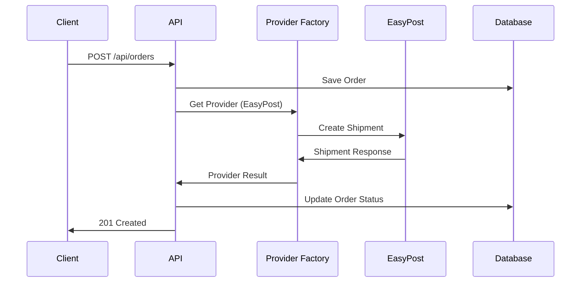
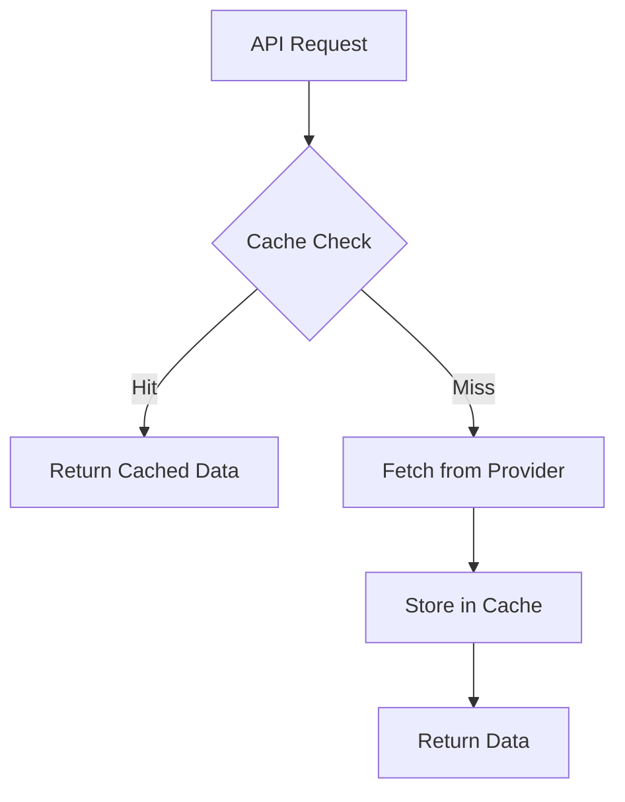

# Architecture Overview

This document provides a comprehensive overview of the Multiship platform architecture, including system design, component relationships, and data flow patterns.

## 🎯 System Overview

Multiship is a multi-carrier shipping platform that provides a unified API for integrating with multiple shipping providers (EasyPost, Shippo, Veeqo). The platform consists of:

- **Backend API**: Fastify-based REST API with TypeScript
- **Frontend Application**: Next.js web interface
- **Database Layer**: PostgreSQL with Prisma ORM
- **Cache Layer**: Redis for performance optimization
- **Provider Layer**: Unified interface to multiple shipping providers
- **Infrastructure**: Docker Compose for local development and containerized deployment

## 🏗️ Architecture Principles

### Modularity
- **Monorepo Structure**: PNPM workspace with shared packages
- **Provider Abstraction**: Unified interface for all shipping providers
- **Pluggable Architecture**: Easy to add new shipping providers

### Scalability
- **Horizontal Scaling**: Stateless API design enables horizontal scaling
- **Caching Strategy**: Redis-based caching for performance optimization
- **Circuit Breaker**: Automatic failover and error recovery

### Reliability
- **Error Handling**: Comprehensive error classification and recovery
- **Health Checks**: Continuous monitoring of all components
- **Graceful Degradation**: System continues operating with reduced functionality

## 🧩 Component Architecture

### Core Components

```
┌─────────────────────────────────────────────────────────────────┐
│                            Frontend (Next.js)                   │
├─────────────────────────────────────────────────────────────────┤
│  ┌─────────────┐  ┌─────────────┐  ┌─────────────┐              │
│  │   Pages     │  │ Components  │  │   API       │              │
│  │             │  │             │  │  Client     │              │
│  └─────────────┘  └─────────────┘  └─────────────┘              │
└─────────────────────────────────────────────────────────────────┘
          │                           │
          │ HTTP/REST                 │ WebSocket
          │                           │
┌─────────────────────────────────────────────────────────────────┐
│                       Backend API (Fastify)                     │
├─────────────────────────────────────────────────────────────────┤
│  ┌─────────────┐  ┌─────────────┐  ┌─────────────┐              │
│  │   Routes    │  │ Middleware  │  │  Services   │              │
│  │             │  │             │  │             │              │
│  │ • Health    │  │ • Logging   │  │ • Orders    │              │
│  │ • Shipments │  │ • Security  │  │ • Providers │              │
│  │ • Webhooks  │  │ • CORS      │  │ • Cache     │              │
│  └─────────────┘  └─────────────┘  └─────────────┘              │
└─────────────────────────────────────────────────────────────────┘
          │                           │
          │                           │
┌─────────────────────────────────────────────────────────────────┐
│                     Provider Layer                             │
├─────────────────────────────────────────────────────────────────┤
│  ┌─────────────┐  ┌─────────────┐  ┌─────────────┐              │
│  │   Factory   │  │  Adapters   │  │   Cache     │              │
│  │             │  │             │  │             │              │
│  │ • Singleton │  │ • EasyPost  │  │ • Redis     │              │
│  │ • Registry  │  │ • Shippo    │  │ • Memory    │              │
│  │ • Health    │  │ • Veeqo     │  │ • Strategy  │              │
│  └─────────────┘  └─────────────┘  └─────────────┘              │
└─────────────────────────────────────────────────────────────────┘
          │                           │
          │                           │
┌─────────────────────────────────────────────────────────────────┐
│                    External Services                           │
├─────────────────────────────────────────────────────────────────┤
│  ┌─────────────┐  ┌─────────────┐  ┌─────────────┐              │
│  │   EasyPost  │  │   Shippo    │  │   Veeqo     │              │
│  │   API       │  │   API       │  │   API       │              │
│  └─────────────┘  └─────────────┘  └─────────────┘              │
└─────────────────────────────────────────────────────────────────┘
```

### Data Layer

```
┌─────────────────────────────────────────────────────────────────┐
│                           Database                              │
├─────────────────────────────────────────────────────────────────┤
│  ┌─────────────┐  ┌─────────────┐  ┌─────────────┐              │
│  │   Prisma    │  │ PostgreSQL  │  │  Migrations │              │
│  │   Client    │  │             │  │             │              │
│  │             │  │ • Orders    │  │ • Schema    │              │
│  │ • Schema    │  │ • Shipments │  │ • Seeds     │              │
│  │ • Queries   │  │ • Providers │  │ • Rollback  │              │
│  │ • Mutations │  │ • Users     │  └─────────────┘              │
│  └─────────────┘  └─────────────┘                              │
└─────────────────────────────────────────────────────────────────┘
```

## 🔄 Data Flow

### Order Processing Flow



### Cache Flow



## 🚀 Key Features

### Multi-Provider Support
- **Unified API**: Single interface for all shipping providers
- **Automatic Failover**: Seamless switching between providers
- **Load Balancing**: Distribute requests across providers

### Performance Optimization
- **Redis Caching**: Reduce API calls and improve response times
- **Connection Pooling**: Efficient database connection management
- **Background Jobs**: Async processing for heavy operations

### Monitoring & Observability
- **Health Checks**: Continuous monitoring of all components
- **Metrics Collection**: Performance and usage metrics
- **Distributed Tracing**: Request tracing across services

## 🛡️ Security Architecture

### Authentication
- **API Key Authentication**: Secure API access
- **JWT Tokens**: Session management
- **Rate Limiting**: Prevent abuse and ensure fair usage

### Data Protection
- **Encryption at Rest**: Database encryption
- **Encryption in Transit**: TLS/HTTPS for all communications
- **Input Validation**: Comprehensive input sanitization

## 📊 Performance Characteristics

### Scalability Metrics
- **Horizontal Scaling**: Support for multiple API instances
- **Database Optimization**: Efficient queries and indexing
- **Cache Hit Rate**: >95% for frequently accessed data

### Reliability Metrics
- **Uptime**: 99.9% SLA target
- **Error Rate**: <0.1% for normal operations
- **Recovery Time**: <5 minutes for component failures

## 🔧 Technology Stack

### Backend
- **Framework**: Fastify (Node.js)
- **Language**: TypeScript
- **Database**: PostgreSQL with Prisma ORM
- **Cache**: Redis
- **Validation**: Zod schemas

### Frontend
- **Framework**: Next.js 14+
- **Language**: TypeScript
- **Styling**: Tailwind CSS
- **State Management**: React Query

### Infrastructure
- **Containerization**: Docker
- **Orchestration**: Docker Compose
- **Monitoring**: Custom health check system
- **Logging**: Structured logging with correlation IDs

## 📈 Future Architecture Considerations

### Planned Improvements
- **Service Mesh**: Istio for microservices management
- **Event Streaming**: Apache Kafka for event-driven architecture
- **GraphQL API**: Alternative to REST API
- **Multi-Region**: Global deployment support

### Scaling Strategies
- **Read Replicas**: Database read scaling
- **CDN Integration**: Static asset optimization
- **Edge Computing**: Cloudflare Workers for global performance

---

*This architecture document is continuously updated to reflect the current system design. For questions about specific components, please refer to the detailed component documentation.*